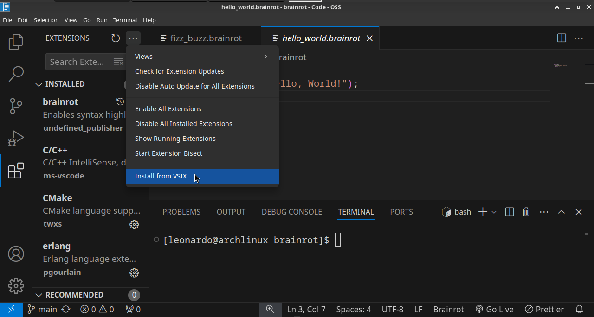

# VSCode Extension Installation Guide

This guide will walk you through the steps to install the **Brainrot** VSCode extension manually using the `.vsix` file.

---

## **Step 1:** Download the Extension

- Navigate to the [GitHub releases page](https://github.com/Brainrotlang/brainrot-vscode-extension/releases).
- Download the latest `.vsix` file.

---

## **Step 2:** Open VSCode

- Launch VSCode on your system.

---

## **Step 3:** Open the Extensions Sidebar

- Click the **Extensions** icon on the left sidebar.

---

## **Step 4:** Open the Options Menu

- Click the **three dots** at the top-right corner of the Extensions view.

---

## **Step 5:** Install from VSIX

- In the drop-down menu, select **Install from VSIX...**.

---

## **Step 6:** Select the Downloaded File

- In the file browser, navigate to the location where you downloaded the `.vsix` file.
- Select the `.vsix` file and click **Install**.

---

## **Step 7:** Success!

- Once installed, the extension should now be active, and you can start using it with your projects.

---

## **Troubleshooting**

- If you encounter any issues, make sure you have downloaded the latest version of the `.vsix` file.
- Ensure that you have no existing conflicting versions of the extension installed.

Happy coding! 🎉
